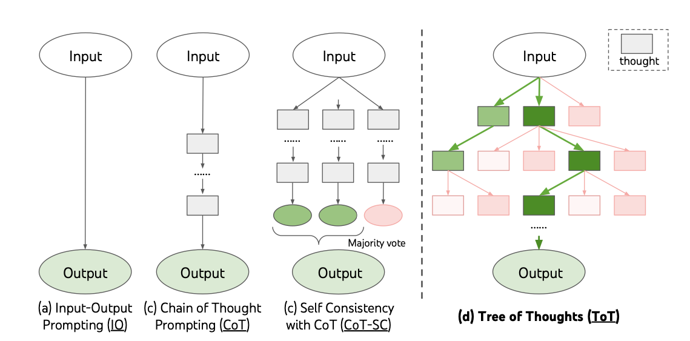

# Official Repo of Tree of Thoughts (ToT)

<p>
    <a href="https://badge.fury.io/py/tree-of-thoughts-llm">
        
    </a>
    <a href="https://www.python.org/">
        
    </a>
    <a href="https://copyright.princeton.edu/policy">
        
    </a>
    <a href="https://zenodo.org/badge/latestdoi/642099326">
        
    </a>
</p>



Official implementation for paper [Tree of Thoughts: Deliberate Problem Solving with Large Language Models](https://arxiv.org/abs/2305.10601) with code, prompts, model outputs.
Also check [its tweet thread](https://twitter.com/ShunyuYao12/status/1659357547474681857) in 1min.


## Setup
1. Set up OpenAI API key and store in environment variable ``OPENAI_API_KEY`` (see [here](https://help.openai.com/en/articles/5112595-best-practices-for-api-key-safety)). 

2. Install `tot` package in two ways:
- Option 1: Install from PyPI
```bash
pip install tree-of-thoughts-llm
```
- Option 2: Install from source
```bash
git clone https://github.com/princeton-nlp/tree-of-thought-llm
cd tree-of-thought-llm
pip install -r requirements.txt
pip install -e .  # install `tot` package
```


## Quick Start
The following minimal script will attempt to solve the game of 24 with `4 5 6 10` (might be a bit slow as it's using GPT-4):
```python
import argparse
from tot.methods.bfs import solve
from tot.tasks.game24 import Game24Task

args = argparse.Namespace(backend='gpt-4', temperature=0.7, task='game24', naive_run=False, prompt_sample=None, method_generate='propose', method_evaluate='value', method_select='greedy', n_generate_sample=1, n_evaluate_sample=3, n_select_sample=5)

task = Game24Task()
ys, infos = solve(args, task, 900)
print(ys[0])
```

And the output would be something like (note it's not deterministic, and sometimes the output can be wrong):
```
10 - 4 = 6 (left: 5 6 6)
5 * 6 = 30 (left: 6 30)
30 - 6 = 24 (left: 24)
Answer: (5 * (10 - 4)) - 6 = 24
```

## Paper Experiments

Run experiments via ``sh scripts/{game24, text, crosswords}/{standard_sampling, cot_sampling, bfs}.sh``, except in crosswords we use a DFS algorithm for ToT, which can be run via ``scripts/crosswords/search_crosswords-dfs.ipynb``.

The very simple ``run.py`` implements the ToT + BFS algorithm, as well as the naive IO/CoT sampling. Some key arguments:

- ``--naive_run``: if True, run naive IO/CoT sampling instead of ToT + BFS.
-  ``--prompt_sample`` (choices=[``standard``, ``cot``]): sampling prompt
- ``--method_generate`` (choices=[``sample``, ``propose``]): thought generator, whether to sample independent thoughts (used in Creative Writing) or propose sequential thoughts (used in Game of 24)
- ``--method_evaluate`` (choices=[``value``, ``vote``]): state evaluator, whether to use the value states independently (used in Game of 24) or vote on states together (used in Creative Writing)
- ``--n_generate_sample``: number of times to prompt for thought generation
- ``--n_evaluate_sample``: number of times to prompt for state evaluation
- ``--n_select_sample``: number of states to keep from each step (i.e. ``b`` in the paper's ToT + BFS algorithm)


## Paper Trajectories
``logs/`` contains all the trajectories from the paper's experiments, except for ``logs/game24/gpt-4_0.7_propose1_value3_greedy5_start900_end1000.json`` which was reproduced after the paper (as the original experiment was done in a notebook) and achieved a 69\% score instead of the original 74\% score due to randomness in GPT decoding. We hope to aggregate multiple runs in the future to account for sampling randomness and update the paper, but this shouldn't affect the main conclusions of the paper.

## How to Add A New Task
Setting up a new task is easy, and mainly involves two steps.
* Set up a new task class in ``tot/tasks/`` and task files in ``tot/data/``. See ``tot/tasks/game24.py`` for an example. Add the task to ``tot/tasks/__init__.py``.
* Set up task-specific prompts in ``tot/prompts/``. See ``tot/prompts/game24.py`` for an example. Depending on the nature of the task, choose ``--method_generate`` (choices=[``sample``, ``propose``]) and ``--method_evaluate`` (choices=[``value``, ``vote``]) and their corresponding prompts. 

## Citations
Please cite the paper and star this repo if you use ToT and find it interesting/useful, thanks! Feel free to contact shunyuyao.cs@gmail.com or open an issue if you have any questions.

```bibtex
@misc{yao2023tree,
      title={{Tree of Thoughts}: Deliberate Problem Solving with Large Language Models}, 
      author={Shunyu Yao and Dian Yu and Jeffrey Zhao and Izhak Shafran and Thomas L. Griffiths and Yuan Cao and Karthik Narasimhan},
      year={2023},
      eprint={2305.10601},
      archivePrefix={arXiv},
      primaryClass={cs.CL}
}
```
